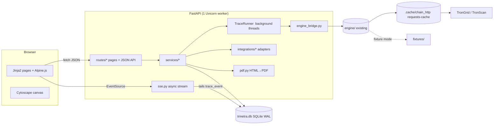

# 05 · Application architecture

## 1. Shape



Server-rendered pages; Alpine handles local interactivity; JSON endpoints for actions; one SSE
stream for live traces. The engine never talks to the database; the app never talks to TronGrid directly.

## 2. Dependencies

```
# engine (existing)
requests  requests-cache  python-dotenv
# app
fastapi  uvicorn[standard]  jinja2  sqlmodel  sse-starlette  itsdangerous  python-multipart
pypdf                      # watermark/metadata; page stamping if renderer lacks it
pdfkit OR weasyprint OR playwright   # ONE, per docs/10 D-01
# test
pytest  httpx  playwright
```
Vendored browser assets (`app/static/vendor/`, pinned versions recorded in `app/static/vendor/VERSIONS.txt`):
Alpine.js 3, Cytoscape.js 3, dagre, cytoscape-dagre, cytoscape-node-html-label (if D-02 keeps it);
fonts Noto Sans + Noto Sans Mono (woff2) in `app/static/fonts/`.

## 3. Runtime model

**Single process, single Uvicorn worker.** SQLite and in-process trace threads assume one process.

### TraceRunner (the only non-trivial concurrency in the app)

Why not stream straight from the engine generator inside the HTTP request: the engine is synchronous
and blocking (requests), a browser refresh or network blip would kill the trace, and a finished
trace must replay instantly. So:

1. `POST /api/cases/{id}/traces` creates `trace_snapshot(status=running)` and calls `runner.start(snapshot_id)`.
2. `runner.start` launches a daemon thread (bounded by a semaphore, `MAX_CONCURRENT_TRACES=2`, to respect TronGrid limits).
3. The thread iterates `engine_bridge.trace(...)`. For each event: assign `seq`, insert a `trace_event` row, notify waiters.
4. On completion: persist `hop` rows, `finding` (if custody), `result_json`, `sha256`, `status=complete`, audit row, case stage transition. On exception: `status=failed`, emit `error` event.
5. `GET /api/traces/{id}/stream` (async): read `Last-Event-ID` (or 0), send all stored events with `seq >` it, then wait on the notifier (timeout 15 s → heartbeat comment), repeat until the `done` event is sent.
6. On app startup: any snapshot still `running` is marked `failed` with reason `interrupted` (offer Restart).

Fixture pacing: `TRACE_PACING_MS` (default 0; set ~400–700 for stage demos in fixture mode) sleeps
between emitted events so the Live Trace screen is readable. Never applied in live mode. The footer
shows the data mode (docs/10 D-05).

### SQLite settings

`create_engine("sqlite:///var/trinetra.db", connect_args={"check_same_thread": False})`, on connect:
`PRAGMA journal_mode=WAL; PRAGMA busy_timeout=5000; PRAGMA foreign_keys=ON`. Short transactions;
one writer thread per trace.

## 4. Repo layout (app)

```
app/
  main.py               # app factory, middleware (session, CSRF, audit context), routers, static
  config.py             # .env → Settings (single object)
  db.py                 # engine, session dependency, pragmas, create_all()
  models.py             # SQLModel tables (§6)
  auth.py               # current_officer(), require_role()
  audit.py              # append(), verify_chain()
  copy.py               # user-facing strings shared across screens
  money.py              # base-units ⇄ Decimal ⇄ "17,880.00 USDT"; IST formatting; address/hash truncation
  engine_bridge.py      # THE ONLY import of engine/
  runner.py             # TraceRunner
  pdf.py                # HTML → PDF, watermark, sha256
  services/
    cases.py            # stage machine, computed counts, ages, attention flags
    traces.py           # snapshot lifecycle, supersede, event persistence, result → hops/finding
    findings.py         # review checks, terminal-variant view model
    notices.py          # numbering, render, countersign rules, VASP response recording
    dispatch.py         # channel fan-out, retry
    exhibit.py          # server-side SVG graph exhibit from a snapshot (docs/10 D-02)
    risk.py             # risk score composition (isolated; ML plugs in here)
    search.py           # exact-match lookup
  integrations/
    complaints/{base,ncrp_fixture}.py
    dispatch/{base,email,mock_le_portal}.py
    advisory/{ofac,chainabuse}.py      # local file / cached JSON
  routes/
    pages.py  auth.py  api_cases.py  api_traces.py  api_notices.py  api_misc.py  sse.py
  templates/
    base.html  _nav_rail.html  _header.html  _footer.html  _macros.html
    login.html  auth_pending.html
    intake.html  traces_list.html  trace_live.html  canvas.html
    findings_list.html  verdict.html  notices_list.html  notice.html
    notice_document.html  report_document.html     # the two print templates
    docket.html  risk.html  activity_log.html  errors/{404,500}.html
  static/
    css/{tokens,base,components,canvas,print}.css
    js/{app,stores,canvas,trace_live,notice}.js
    vendor/  fonts/  img/
scripts/seed.py         # rebuild var/trinetra.db from docs/demo_case.json (+ --filler N)
tests/app/
var/                    # gitignored: trinetra.db, pdf/, exhibits/
```

## 5. Configuration (`.env.example`)

```
# engine
TRINETRA_MODE=fixture                 # fixture | live
TRONGRID_API_KEY=
TRONSCAN_API_KEY=
TRINETRA_CACHE_EXPIRE=900             # -1 before an offline demo
TRINETRA_MAX_RPS=10
# app
SESSION_SECRET=                       # long random string
TRACE_PACING_MS=0                     # fixture demo pacing; ignored in live mode
MAX_CONCURRENT_TRACES=2
DEMO_CLOCK=                           # e.g. 2026-08-30T09:41:00+05:30 pins "now"; empty = real time
# login
CCTNS_LOGIN_URL=                      # see docs/10 D-11 before setting
PARICHAY_LOGIN_URL=
SSO_LINK_TARGET=new_tab               # new_tab | same_tab
SSO_CALLBACK_ENABLED=false            # true only after onboarding
PROTOTYPE_LOGIN_ENABLED=true
# integrations
COMPLAINT_SOURCE=ncrp_fixture
LE_PORTAL=mock
SMTP_HOST=  SMTP_PORT=587  SMTP_USER=  SMTP_PASS=  SMTP_FROM=
# notice
NOTICE_PDF_WATERMARK=SPECIMEN - PROTOTYPE, NOT FOR SERVICE   # empty disables; PDF only, never the preview
COUNTERSIGN_THRESHOLD_USDT=10000.00
```

## 6. Data model (SQLModel)

Amounts: `*_base` columns are `int` (USDT base units, 6 decimals). Times: `*_ts` are `int` UTC epoch ms.

```
officer          id, pis UNIQUE, name, rank, desk, role(investigating_officer|supervising_officer), active
auth_event       id, officer_id, method(prototype|cctns|parichay), ts, ip, ok
complaint        id, ack_no UNIQUE, source, typology, jurisdiction, filed_ts, payment_ts,
                 amount_reported_base, chain, asset, reported_address, payment_txid?,
                 complainant_contact, raw_json, ingested_ts, ingested_by
case             id, ack_no FK, fir_no?, stage, assigned_officer_id, created_ts, updated_ts
trace_snapshot   id, case_id, version, params_json, status(running|complete|failed|superseded),
                 superseded_by?, started_ts, closed_ts?, terminal_kind?, result_json?, sha256?, fail_reason?
trace_event      id, snapshot_id, seq, type, data_json          UNIQUE(snapshot_id, seq)
hop              id, snapshot_id, hop_index, address, value_base, onward_base?, share_bp,
                 ts, txids_json, classification, band, confidence, is_dominant, branch_id?
entity           key, name, type, jurisdiction, fiu_ind_reg?, fiu_status, india_compliance_desk,
                 le_portal?, compliance_email?
attribution      id, address, entity_key?, class, band, confidence, rung, source, revision, updated_ts
finding          id, snapshot_id, terminal_kind, custodian_key?, deposit_address?, amount_credited_base?,
                 band, basis_json, review_json, reviewed_by?, reviewed_ts?, superseded
note             id, case_id, snapshot_id?, address?, body, author_id, created_ts
notice           id, case_id, finding_id, notice_no UNIQUE, addressee, amount_base, deadline_hours,
                 html_sha256, pdf_path?, pdf_sha256?, status(draft|awaiting_countersign|countersigned|dispatched),
                 drafted_by, drafted_ts
countersignature id, notice_id UNIQUE, officer_id, session_id, signed_ts
dispatch         id, notice_id, channel, target, status(queued|sent|failed|acknowledged),
                 attempts, last_error?, external_ref?, sent_ts?, acknowledged_ts?
vasp_response    id, notice_id, received_ts, reference, kyc_disclosed(bool), amount_restrained_base,
                 account_ref_hint?, recorded_by            # feeds rung 4 and docket "frozen" values
advisory_entry   address, list(ofac|chainabuse), label, fetched_ts
risk_check       id, address, score, band, signals_json, checked_by, checked_ts
audit_log        id, ts, officer_id?, case_id?, action, payload_json, prev_hash, row_hash
```

Rules enforced in `services/notices.py` (and tested): countersigner must be `supervising_officer`
and `!= notice.drafted_by`; countersignature required iff `amount_base ≥ threshold`; dispatch
blocked until countersigned when required.

**Case stages:** `awaiting_trace → tracing → custody_found | attribution_pending | closed_no_custody →
notice_drafted → notice_out → restraint_confirmed | closed_no_custody`. "Overdue" (`sent_ts + deadline < now`
and not acknowledged) and "stalled" (`tracing` > 24 h) are derived, never stored.

**Audit:** `row_hash = sha256(prev_hash + canonical_json(row minus hashes))`. Logged: sign-in/out,
complaint ingest, trace start/restart/complete, finding review ticks, notice draft/countersign/
dispatch, VASP response recorded, PDF download, risk check. Not logged: page views, node clicks.

## 7. Integration adapters

```python
class ComplaintSource(Protocol):
    def fetch(self, ack_no: str) -> ComplaintRecord | None
    def referrals_today(self, desk: str) -> list[ComplaintSummary]
    def health(self) -> Health                    # drives the "NCRP feed connected" pill
class DispatchChannel(Protocol):
    key: str
    def send(self, notice: Notice, pdf: bytes) -> DispatchResult   # status, external_ref, error
```
Advisory lists are read-only lookups: OFAC SDN (local file, TRON addresses extracted), Chainabuse
(cached JSON in fixture mode). Login is not an adapter in v1 (links only; docs/07 §00).

## 8. HTTP surface

Pages (server-rendered, auth required except `/login`):
`/login` · `/cases/new` · `/docket` · `/traces` · `/traces/{snapshot_id}` · `/cases/{id}/canvas` ·
`/findings` · `/findings/{id}` · `/notices` · `/notices/{id}` · `/risk-check` · `/me/activity`

Auth: `POST /auth/prototype` (IO) · `POST /auth/prototype?role=supervisor` (unlinked; second
browser for countersign demo) · `GET /auth/callback/{provider}` → `auth_pending.html` while
`SSO_CALLBACK_ENABLED=false` · `POST /auth/logout`.

JSON:
```
GET  /healthz                                  db, mode, sources, cache status
GET  /api/search?q=                            exact: TRON address | 64-hex txid | NCRP ack
POST /api/complaints/ingest {ack_no}           → particulars (8 fields) + detected chain
POST /api/cases/{id}/traces {params?}          → {snapshot_id}
POST /api/traces/{id}/restart                  → {snapshot_id}   (old → superseded)
GET  /api/traces/{id}/stream                   SSE (docs/06 §4)
GET  /api/traces/{id}                          snapshot for canvas
GET  /api/addresses/{addr}?snapshot=           classification, attribution, transfers (right panel)
POST /api/cases/{id}/notes {body, address?}
POST /api/findings/{id}/review {checks:[bool×4]}
POST /api/cases/{id}/notices                   → draft
PATCH /api/notices/{id} {deadline_hours, channels}
POST /api/notices/{id}/request-countersign
POST /api/notices/{id}/countersign
POST /api/notices/{id}/dispatch
POST /api/dispatch/{id}/retry
POST /api/notices/{id}/response {…vasp_response}
GET  /api/notices/{id}/pdf   GET /api/snapshots/{id}/report.pdf   GET /api/snapshots/{id}/exhibit.svg
GET  /api/docket?stage=&q=
POST /api/risk-check {address}
GET  /api/audit/verify                          supervisor only
```

## 9. Security baseline (proportionate to a prototype)

Signed session cookie (`HttpOnly`, `SameSite=Lax`, `Secure` behind the tunnel). CSRF: token in a
`<meta>` tag, required as `X-CSRF-Token` on every mutating fetch. Role guard dependency. No user
input ever reaches a shell; the PDF renderer receives a file path we generated. Jinja2 autoescape on.
Addresses/hashes validated with strict regexes before any lookup (TRON: base58check via the engine's `matches`).
